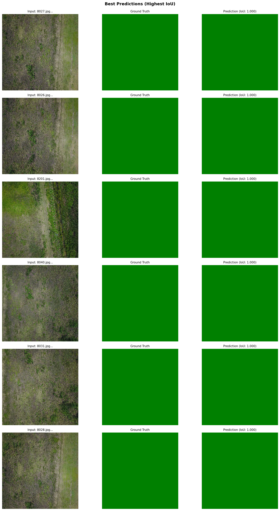
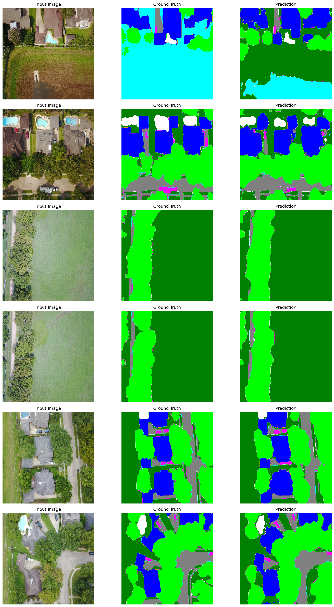
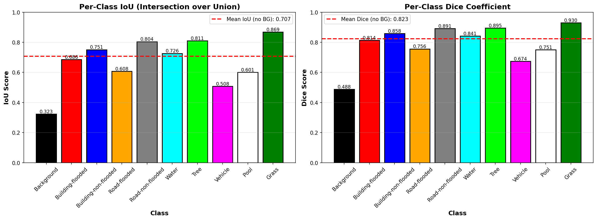
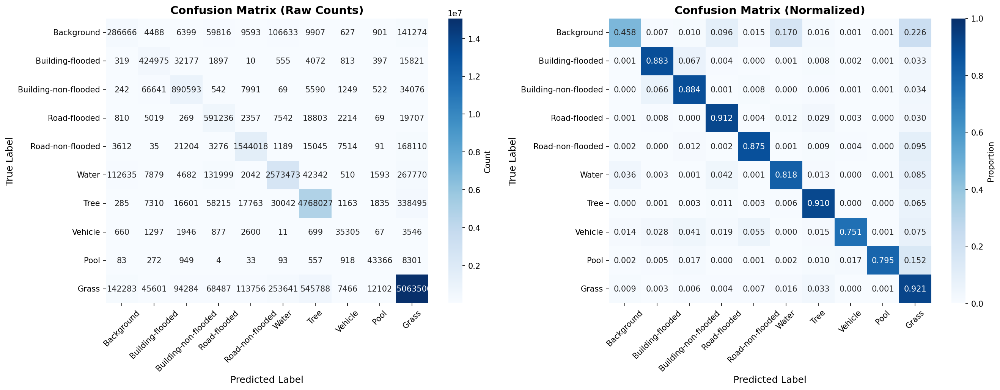
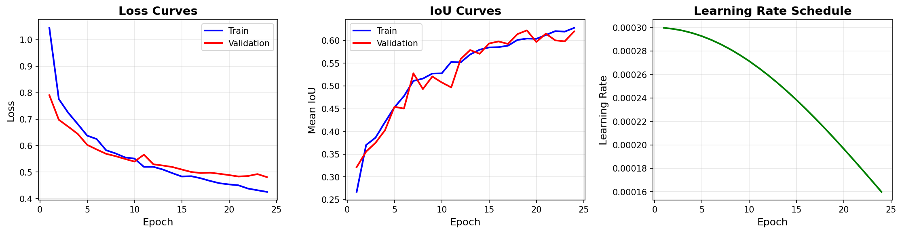

# Disaster Segmentation

<p>
  
  
  
  
</p>

Deep learning semantic segmentation for disaster-response imagery. This project segments flood-affected UAV/aerial images into pixel-level scene classes so emergency teams can quickly inspect water, roads, buildings, vegetation, and damaged regions.

## Results at a Glance

| Metric | Score |
|---|---:|
| Test Mean IoU, no background | **70.70%** |
| Validation Mean IoU, no background | **66.71%** |
| Pixel Accuracy | **89.31%** |
| Mean Dice Coefficient | **82.33%** |
| Test Images | **448** |
| Validation Images | **450** |

Model checkpoint: `unet_resnet34_best.pth`

## Visual Results

| Output | Preview |
|---|---|
| Best predictions |  |
| Validation predictions |  |
| Per-class metrics |  |
| Confusion matrix |  |
| Training curves |  |

## Problem Statement

After floods and natural disasters, responders need fast visibility into affected areas. Manual interpretation of aerial imagery is slow, subjective, and difficult to scale across large regions.

This project uses semantic segmentation to classify each pixel in FloodNet imagery, enabling structured damage assessment from visual data.

## Dataset

Dataset: **FloodNet**

| Item | Details |
|---|---|
| Task | Semantic segmentation |
| Image type | UAV/aerial flood imagery |
| Input size | 256 x 256 |
| Train images | 1,445 |
| Validation images | 450 |
| Test images | 448 |
| Classes | Background, flooded building, non-flooded building, flooded road, non-flooded road, water, tree, vehicle, pool, grass |

## Model Architecture

The final model uses a U-Net segmentation architecture with an ImageNet-pretrained ResNet34 encoder.

```text
RGB Flood Image
      |
      v
Preprocessing + Augmentation
      |
      v
U-Net Decoder + ResNet34 Encoder
      |
      v
Pixel-level Class Mask
      |
      v
Overlay + Metrics + Error Analysis
```

| Component | Value |
|---|---|
| Model | U-Net |
| Encoder | ResNet34 |
| Pretraining | ImageNet |
| Trainable parameters | 24,437,674 |
| Loss | 50% Cross-Entropy + 50% Dice |
| Optimizer | AdamW |
| Scheduler | Cosine Annealing |
| Batch size | 8 |
| Epochs | 24, early stopped from 50 |
| Augmentations | Flips, brightness/contrast changes, Gaussian noise |

## Repository Structure

```text
Disaster-segmentation/
|-- configs/                 # Training and production configs
|-- data/                    # FloodNet sample/raw structure
|-- notebooks/               # End-to-end workflow notebooks
|-- results/
|   |-- evaluation/           # Evaluation outputs
|   |-- metrics/              # Per-class metrics and class weights
|   |-- reports/              # Text reports
|   `-- visualizations/       # Training, prediction, and evaluation plots
|-- src/
|   |-- data/                 # Dataset, dataloader, preprocessing
|   |-- evaluation/           # Metrics and visualization
|   |-- inference/            # Prediction scripts
|   |-- models/               # U-Net, ResUNet, Attention U-Net
|   |-- training/             # Losses, metrics, training loop
|   `-- utils/                # Config, logging, helpers
|-- tests/                    # Project checks
|-- README.md
`-- REPORT.md
```

## Run Locally

```bash
git clone https://github.com/jeevanraj-28/Disaster-segmentation.git
cd Disaster-segmentation
python -m venv .venv
.venv\Scripts\activate
pip install -r requirements.txt
```

Run training or evaluation from the provided notebooks:

```text
notebooks/01_clean_preprocess_floodnet.ipynb
notebooks/02_preprocessing.ipynb
notebooks/03_train_unet_basic.ipynb
notebooks/04_evaluation.ipynb
notebooks/05_visualization.ipynb
notebooks/07_test_inference.ipynb
notebooks/08_final_report.ipynb
```

For macOS/Linux:

```bash
source .venv/bin/activate
```

## Key Reports

- [Final results summary](results/FINAL_RESULTS_SUMMARY.txt)
- [Training summary](results/FINAL_TRAINING_SUMMARY.txt)
- [Leaderboard score](results/FINAL_LEADERBOARD_SCORE.txt)
- [Test evaluation report](results/reports/test_evaluation_report.txt)
- [Research report outline](REPORT.md)

## Why This Project Matters

This is not a tutorial segmentation repo. It includes an end-to-end disaster AI workflow: preprocessing, augmentation, model training, evaluation, per-class analysis, visual diagnostics, and final reporting. The project demonstrates practical computer vision engineering for a real emergency-response use case.

## Future Work

- Add a Streamlit demo for uploading flood imagery and viewing masks.
- Compare U-Net, DeepLabV3+, SegFormer, and Mask2Former.
- Add class-specific error analysis for roads, vehicles, and flooded buildings.
- Add ONNX export for faster inference.
- Package inference behind a FastAPI endpoint.

## Author

**Jeevan Raj M**  
AI/ML Engineer | Computer Vision | Disaster AI  

[LinkedIn](https://linkedin.com/in/jeevan-raj-m-5ba64a383) | [GitHub](https://github.com/jeevanraj-28) | [Email](mailto:jeevanrajm2882004@gmail.com)
