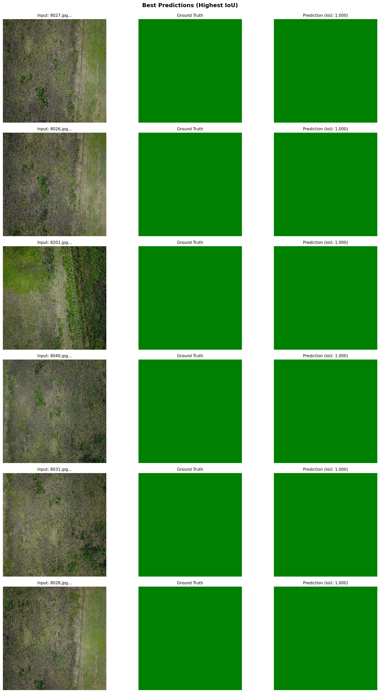
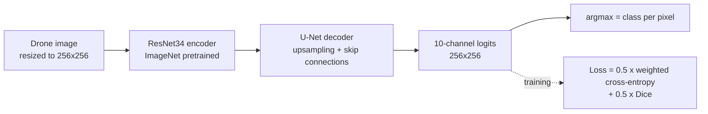

# Disaster Segmentation: Flood Damage Mapping from Drone Images

Pixel-level semantic segmentation of post-flood drone imagery (FloodNet) into 10 classes such as flooded building, flooded road, water and vehicle, so responders can see what is under water at a glance. U-Net with an ImageNet-pretrained ResNet34 encoder in PyTorch.


**Test set (448 held-out images): 70.7% mean IoU excluding background, 89.3% pixel accuracy.**



---

## Contents

1. [Results](#results)
2. [Quick start](#quick-start)
3. [Get the data](#get-the-data)
4. [Train, evaluate, predict](#train-evaluate-predict)
5. [Method](#method)
6. [Experiment log](#experiment-log)
7. [Error analysis](#error-analysis)
8. [Project structure](#project-structure)
9. [Limitations and next steps](#limitations-and-next-steps)

---

## Results

Checkpoint `unet_resnet34_best.pth` (best epoch 38), evaluated once on the 448-image test set at 256 × 256. Metrics are computed over all test pixels together (one confusion matrix), as in [`notebooks/04_evaluation.ipynb`](notebooks/04_evaluation.ipynb).

| Metric | Test |
| --- | --- |
| Mean IoU, excluding background | **70.7%** |
| Mean IoU, all 10 classes | 66.9% |
| Mean Dice, excluding background | 82.3% |
| Pixel accuracy | 89.3% |

**Per class** (pixel share = how much of the test set each class covers):

| Class | Pixel share | IoU | Dice |
| --- | --- | --- | --- |
| Grass | 55.7% | 0.869 | 0.930 |
| Tree | 17.9% | 0.811 | 0.895 |
| Road, not flooded | 6.0% | 0.804 | 0.891 |
| Building, not flooded | 3.4% | 0.751 | 0.858 |
| Water | 10.7% | 0.726 | 0.841 |
| Building, flooded | 1.6% | 0.686 | 0.814 |
| Road, flooded | 2.2% | 0.608 | 0.756 |
| Pool | 0.19% | 0.601 | 0.751 |
| Vehicle | 0.16% | 0.508 | 0.674 |
| Background | 2.1% | 0.323 | 0.488 |

**Why pixel accuracy (89%) is the least useful number here:** grass alone is 56% of all pixels, so a model that is good at grass scores high pixel accuracy even if it misses every vehicle. Mean IoU weights every class equally, which is why it is the headline metric.

**For context:** the FloodNet paper reports 79.7% mIoU for PSPNet and 61.5% for DeepLabV3+ on the same 9 non-background classes, trained at 713 × 713 ([Rahnemoonfar et al., 2021](https://arxiv.org/abs/2012.02951)). The splits and resolution differ, so the numbers are a rough reference rather than a head-to-head comparison. This model at 256 × 256 sits between the two.

---

## Quick start

Check the evaluation code without downloading anything. This rebuilds the metrics from a saved confusion matrix and needs only NumPy:

```bash
git clone https://github.com/jeevanraj-28/Disaster-segmentation.git
cd Disaster-segmentation

python -m venv .venv
# Windows: .venv\Scripts\activate
source .venv/bin/activate

pip install numpy
python -m src.evaluation.evaluate --from-confusion results/evaluation/confusion_matrix.npy
python -m unittest discover -s tests -p "test_*.py" -v
```

For training and inference, install everything (Python 3.10 or 3.11; a CUDA GPU is strongly recommended for training):

```bash
pip install -r requirements.txt
```

If you have a CUDA GPU, install the matching PyTorch build first from [pytorch.org](https://pytorch.org/get-started/locally/).

---

## Get the data

1. Download **FloodNet (Track 1, supervised)** from the [FloodNet repository](https://github.com/BinaLab/FloodNet-Supervised_v1.0).
2. Unzip it so the folders look like this:

```
data/raw/FloodNet/
├── train/train-org-img/   train/train-label-img/   (1,445 images)
├── val/val-org-img/       val/val-label-img/       (450 images)
└── test/test-org-img/     test/test-label-img/     (448 images)
```

Label images are single-channel PNGs where each pixel value is a class index from 0 to 9.

---

## Train, evaluate, predict

**Train** (script version of notebook 03; defaults are the settings of the reported run):

```bash
python -m src.training.train                         # full run: up to 60 epochs, early stopping after 12 without improvement
python -m src.training.train --epochs 1 --limit 32   # quick check that everything works
```

The best checkpoint (by validation IoU) is saved to `models/checkpoints/unet_resnet34_best.pth`, and the per-epoch history to `logs/training_history.json`.

**Evaluate** on the test set (script version of notebook 04):

```bash
python -m src.evaluation.evaluate --checkpoint models/checkpoints/unet_resnet34_best.pth
python -m src.evaluation.evaluate --checkpoint models/checkpoints/unet_resnet34_best.pth --tta   # + flip test-time augmentation
```

This writes `results/evaluation/test_report.md` with overall and per-class metrics and the most confused class pairs.

**Predict** on new images:

```bash
python -m src.inference.predict --checkpoint models/checkpoints/unet_resnet34_best.pth \
    --input path/to/image_or_folder --output predictions/
```

For each image it saves a colour mask and an overlay, and prints the share of the image in each class (for example `Water 34%, Grass 28%, Building-flooded 9%`).

| Colour | Class | Colour | Class |
| --- | --- | --- | --- |
| Black | Background | Cyan | Water |
| Red | Building, flooded | Green | Tree |
| Blue | Building, not flooded | Magenta | Vehicle |
| Orange | Road, flooded | White | Pool |
| Grey | Road, not flooded | Dark green | Grass |

---

## Method


```mermaid
flowchart LR
    A[Drone image<br/>resized to 256x256] --> B[ResNet34 encoder<br/>ImageNet pretrained]
    B --> C[U-Net decoder<br/>upsampling + skip connections]
    C --> D[10-channel logits<br/>256x256]
    D --> E[argmax = class per pixel]
    D -. training .-> L[Loss = 0.5 x weighted cross-entropy<br/>+ 0.5 x Dice]
```

| Setting | Value | Why |
| --- | --- | --- |
| Model | U-Net, ResNet34 encoder (`segmentation-models-pytorch`), 24.4 M parameters | Skip connections keep fine spatial detail; pretrained encoder because 1,445 images is a small dataset |
| Input | 256 × 256, ImageNet normalisation | Fits a laptop GPU (RTX 4050) at batch size 8 |
| Loss | 0.5 × cross-entropy (square-root inverse-frequency class weights) + 0.5 × Dice | Cross-entropy gives stable per-pixel gradients; Dice and class weights push against grass dominating |
| Optimiser | AdamW, lr 3e-4, weight decay 1e-4, gradient clipping at 1.0 | AdamW applies weight decay correctly with Adam |
| Schedule | Cosine annealing to 1e-6 over 60 epochs | Smooth decay without manual step choices |
| Early stopping | Stop after 12 epochs without validation improvement; keep the best checkpoint | Training IoU kept rising after epoch 38 while validation did not (overfitting) |
| Augmentation | Flips, 90° rotations, shift/scale/rotate, colour jitter, noise or blur | Drone images have no "up"; lighting and weather vary |
| Split | Official FloodNet 1,445 / 450 / 448 | Test set used only for the final evaluation |

---

## Experiment log

| Run | Epoch budget / patience | Stopped at | Best validation IoU* | Test mIoU (no background) |
| --- | --- | --- | --- | --- |
| A (reported) | 60 / 12 | 50 (best epoch 38) | 0.667 | **0.707** ([notebook 04](notebooks/04_evaluation.ipynb)) |
| B (shorter) | 50 / 5 | 24 | 0.622 | 0.676 ([report](results/reports/test_evaluation_report.txt)) |

\*Validation IoU here is the training-time monitor: the mean over batches of the IoU of the classes present in each batch. Test mIoU is computed once over all pixels. Because they are calculated differently, the validation number should be compared only with other validation numbers, not with test mIoU. This is why test mIoU can be higher than "validation IoU" without the test set being easier.

**What run B suggests:** with patience 5 it stopped at epoch 24, while run A was still improving until epoch 38, and run B scored about 3 points lower on test. That points to patience 5 stopping training too early, though the two runs were not a controlled comparison (same seed, only patience changed). The saved confusion matrix in `results/evaluation/` is from run B; `python -m src.evaluation.evaluate --from-confusion ...` reproduces its numbers exactly.

---

## Error analysis

From the per-class results and the confusion matrix:

- **Small objects are hardest.** Vehicles (0.16% of pixels) and pools (0.19%) have the lowest IoU. At 256 × 256 a car in a large drone image is only a handful of pixels. The FloodNet paper reports the same pattern for every model it tested.
- **Flooded vs not flooded is about context, not shape.** Flooded roads (0.61) and flooded buildings (0.69) score below their non-flooded versions (0.80, 0.75). Their precision is low and recall high: the model over-predicts "flooded" near water.
- **Most errors are between visually similar natural classes.** The largest confusions are grass ↔ tree and water → grass, where texture and colour overlap. Many of these pixels sit on blurry class boundaries.
- **Background is the weakest class (IoU 0.32).** It is a small, mixed "everything else" class with no consistent look. That is why the headline metric excludes it; mIoU over all 10 classes (66.9%) is reported as well.

---

## Project structure

```
Disaster-segmentation/
├── notebooks/                 # The full workflow, with saved outputs
│   ├── 01_clean_preprocess_floodnet.ipynb   # data checks, class distribution, class weights
│   ├── 02_preprocessing.ipynb               # augmentation pipelines
│   ├── 03_train_unet_basic.ipynb            # training (run A log)
│   ├── 04_evaluation.ipynb                  # test evaluation, per-class metrics, confusion
│   ├── 05_visualization.ipynb               # figures
│   ├── 07_test_inference.ipynb              # test-time augmentation experiments
│   └── 08_final_report.ipynb
├── src/                       # The same pipeline as importable code and scripts
│   ├── data/dataset.py        # FloodNet Dataset + augmentations
│   ├── models/model_builder.py  # U-Net builder + checkpoint loader
│   ├── training/train.py      # training script
│   ├── training/losses.py     # CE + Dice (used), Focal + Dice (alternative)
│   ├── training/metrics.py    # confusion-matrix metrics used in the notebooks
│   ├── evaluation/evaluate.py # test evaluation script
│   ├── evaluation/report.py   # metrics + Markdown report (NumPy only)
│   ├── inference/predict.py   # masks and overlays for new images
│   └── utils/config.py        # paths and hyperparameters
├── configs/                   # YAML configs
├── results/                   # reports, confusion matrix, class weights, figures
├── tests/test_metrics.py      # metric tests + reproduces the saved report
├── REPORT.md                  # technical write-up
└── requirements.txt
```

---

## Limitations and next steps

- **Resolution.** Training at 256 × 256 throws away detail that small classes need. Next: train on 512 × 512 tiles cut from the full-resolution images, and stitch predictions back together.
- **One architecture, one seed.** No comparison with DeepLabV3+ or SegFormer yet, and no repeated runs to measure seed-to-seed variance.
- **No ablations.** The effect of the Dice term and the class weights was not measured separately.
- **Next steps**
  - [ ] Tiled training at higher resolution, aimed at vehicles and pools
  - [ ] DeepLabV3+ and SegFormer under the same split and metrics
  - [ ] 3 seeds per configuration to report mean ± standard deviation
  - [ ] ONNX export and a small demo app

---

## Author

**Jeevan Raj M** · [LinkedIn](https://linkedin.com/in/jeevan-raj-m-5ba64a383) · [GitHub](https://github.com/jeevanraj-28) · [Portfolio](https://jeevanraj-28.github.io)

Dataset: FloodNet, Rahnemoonfar et al., *FloodNet: A High Resolution Aerial Imagery Dataset for Post Flood Scene Understanding*, IEEE Access, 2021.
